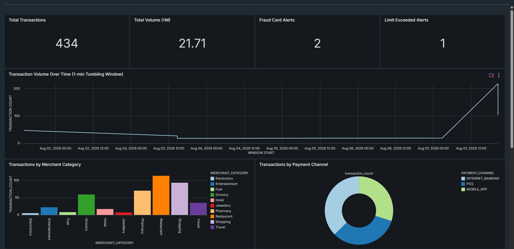
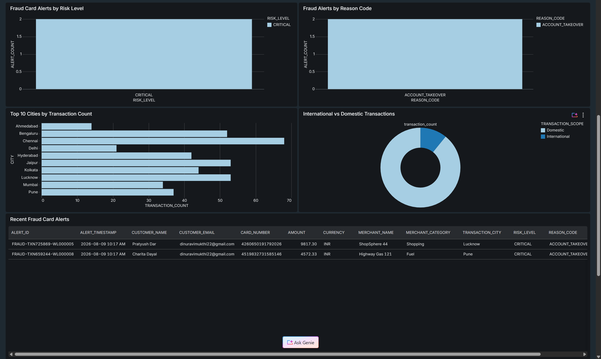
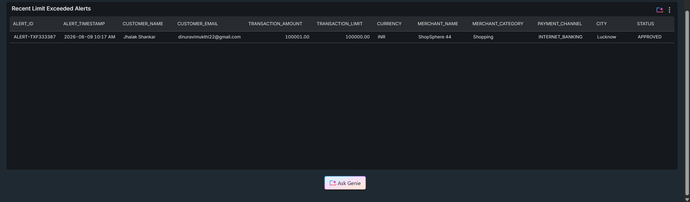
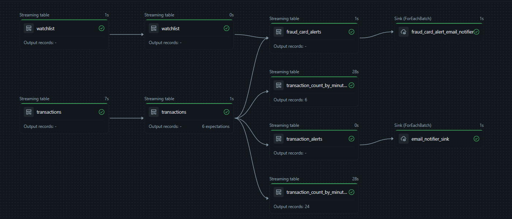
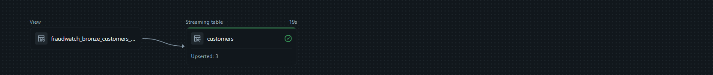
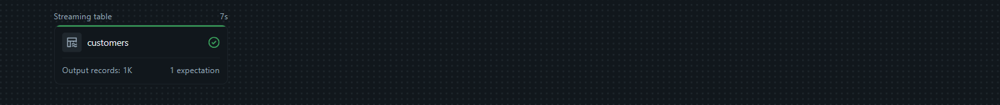
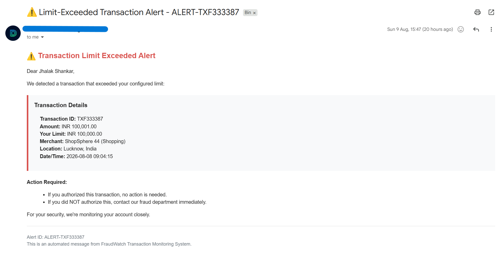
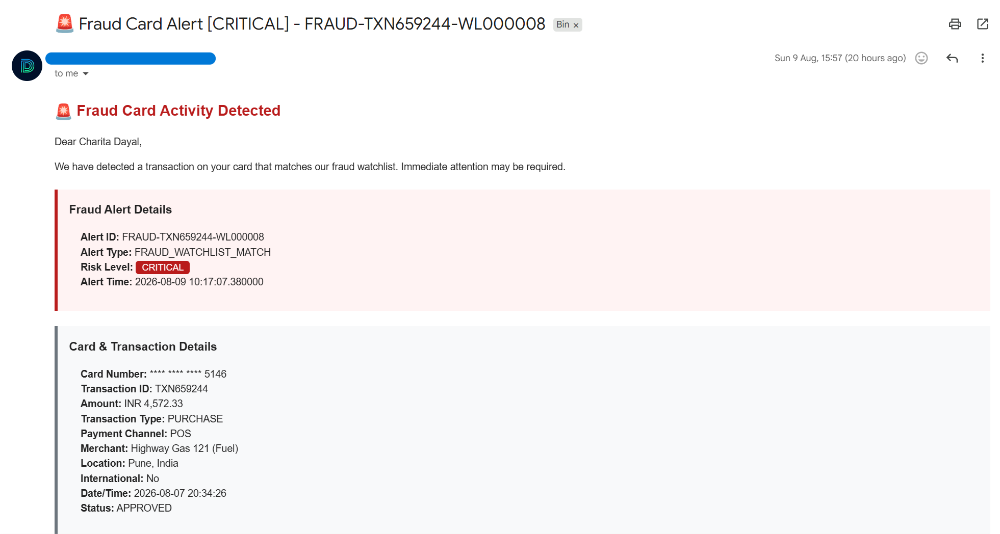
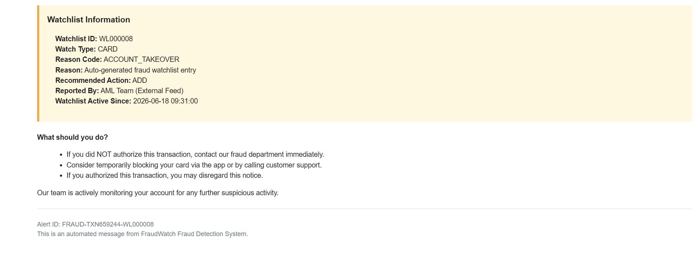

# FraudWatch

Real-time financial fraud detection and transaction monitoring system built on Databricks. FraudWatch ingests live transaction events from Kafka, cross-references them against a curated fraud watchlist, and triggers automated email alerts when suspicious activity or limit-exceeded transactions are detected.

---

## Overview

FraudWatch is a Lakeflow Spark Declarative Pipeline (SDP) project that implements a medallion architecture (Bronze → Silver → Gold) for streaming transaction data. It supports two primary alert types:

- **Fraud Watchlist Match** — flags transactions where the card number matches a known fraudulent entity in the watchlist.
- **Limit-Exceeded Transaction** — flags transactions that exceed a customer's configured spending threshold.

Upon detection, automated email notifications are dispatched to affected customers via Gmail SMTP.

---

## Architecture

```
Kafka Topic (transactions)
        │
        ▼
 ┌─────────────┐      Auto Loader (watchlist CSV)
 │   BRONZE    │◄─────────────────────────────────┐
 │ transactions│      fraudwatch.bronze.watchlist  │
 │   bronze    │                                   │
 └──────┬──────┘                                   │
        │                                          │
        ▼                                          ▼
 ┌─────────────┐                          ┌────────────────┐
 │   SILVER    │                          │     SILVER     │
 │ transactions│                          │   watchlist    │
 │   silver    │                          │    silver      │
 └──────┬──────┘                          └───────┬────────┘
        │                                         │
        │         ┌───────────────────────────────┘
        │         │
        ▼         ▼
 ┌─────────────────────┐     ┌──────────────────────────────────────┐
 │      GOLD           │     │              GOLD                    │
 │ transaction_alerts  │     │ fraud_card_alerts                    │
 │ (limit exceeded)    │     │ (watchlist match)                    │
 └────────┬────────────┘     └──────────────┬───────────────────────┘
          │                                 │
          ▼                                 ▼
  Email Notifier                    Email Notifier
 (limit_exceeded)                 (fraud_card_alert)
```

> **Batch path:** Customer data (`fraudwatch.silver.customers`) is produced separately via `fraudwatch_batch_processing` and is used as a static dimension in the Gold layer joins.

---

## Dashboard






The **FraudWatch Overview** AI/BI dashboard provides a live view of alert volumes, transaction trends, risk levels, and watchlist match breakdowns.

---

## Pipeline





---

## Project Structure

```
FraudWatch/
├── fraudwatch_streaming/              # Lakeflow SDP pipeline source files
│   ├── bronze/
│   │   ├── transactions_bronze.py     # Kafka → bronze streaming table
│   │   └── watchlist_bronze.py        # Auto Loader → bronze watchlist table
│   ├── silver/
│   │   ├── transactions_silver.py     # Parse & clean transactions
│   │   └── watchlist_silver.py        # Parse & clean watchlist entries
│   ├── gold/
│   │   ├── transaction_alerts.py      # Limit-exceeded alert generation
│   │   ├── fraud_card_alerts.py       # Watchlist-match fraud alert generation
│   │   ├── transaction_count_by_minute_tumbling_window.py
│   │   └── transaction_count_by_minute_sliding_window.py
│   └── alert/
│       ├── transaction_alert_email_notifier.py   # Email sink for limit-exceeded alerts
│       └── fraud_card_alert_email_notifier.py    # Email sink for fraud-card alerts
│
├── fraudwatch_batch_processing/       # Batch processing pipeline
│   └── silver/
│       └── customers_silver.py        # Customer dimension table (batch)
│
├── watchlist_file_generator/          # Utility for watchlist data
│   ├── fraud_watchlist_data_generator.ipynb
│   └── fraud_watchlist.csv
│
├── notebooks/                         # Setup & testing notebooks
│   ├── 00_setup.ipynb                 # Environment setup
│   ├── 00_setup_secrets.ipynb         # Databricks secrets configuration
│   ├── 01_kafka_streaming_test.ipynb  # Kafka connectivity test
│   ├── 02_send_email.ipynb            # Email configuration test
│   └── 03_autoloader_test.ipynb       # Auto Loader connectivity test
│
└── README.md
```

---

## Data Flow

### Streaming Path (Transactions)

1. **Bronze** — Raw Kafka messages are ingested into `fraudwatch.bronze.transactions`. Each record preserves the raw Kafka metadata (key, value, topic, partition, offset, timestamp) alongside an `ingestion_ts`.
2. **Silver** — JSON payloads are parsed and typed into `fraudwatch.silver.transactions` with data quality expectations applied.
3. **Gold** — Two alert tables are derived:
   - `fraudwatch.gold.transaction_alerts` — joins with `fraudwatch.silver.customers` and filters for `amount > transaction_limit`.
   - `fraudwatch.gold.fraud_card_alerts` — stream-stream watermark join between transactions and watchlist on `card_number == entity_id`.

### Streaming Path (Watchlist)

1. **Bronze** — Watchlist CSV files are ingested via Auto Loader into `fraudwatch.bronze.watchlist`.
2. **Silver** — Records are normalised (uppercasing, timestamp parsing) into `fraudwatch.silver.watchlist`.

### Batch Path (Customers)

- Customer records are processed in batch into `fraudwatch.silver.customers`, used as a static dimension in the Gold layer.

### Alert / Email Notification

- Two `@dp.foreach_batch_sink` sinks consume the Gold alert tables and dispatch HTML-formatted email alerts to customers via Gmail SMTP.

---

## Unity Catalog Layout

| Layer  | Table                                        | Type      |
| ------ | -------------------------------------------- | --------- |
| Bronze | `fraudwatch.bronze.transactions`             | Streaming |
| Bronze | `fraudwatch.bronze.watchlist`                | Streaming |
| Silver | `fraudwatch.silver.transactions`             | Streaming |
| Silver | `fraudwatch.silver.watchlist`                | Streaming |
| Silver | `fraudwatch.silver.customers`                | Batch     |
| Gold   | `fraudwatch.gold.transaction_alerts`         | Streaming |
| Gold   | `fraudwatch.gold.fraud_card_alerts`          | Streaming |
| Gold   | `fraudwatch.gold.transaction_count_by_minute`| Streaming |

---

## Prerequisites

- Databricks workspace on **Azure** with Unity Catalog enabled
- A running **Kafka** cluster (Confluent Cloud or self-hosted) with SASL/SSL credentials
- **Databricks Secrets** scope `fraudwatch-scope` containing:
  - `kafka-connection-details` — JSON with `bootstrap_servers`, `topic`, `api_key`, `api_secret`
  - `gmail-api-key` — Gmail App Password for the sending account
- A Unity Catalog schema `fraudwatch` with `bronze`, `silver`, and `gold` schemas created

---

## Getting Started

1. **Configure secrets** — Run `notebooks/00_setup_secrets.ipynb` to create the Databricks secrets scope and populate required keys.
2. **Environment setup** — Run `notebooks/00_setup.ipynb` to create the Unity Catalog schemas and any required volume mounts.
3. **Validate connectivity** — Use `notebooks/01_kafka_streaming_test.ipynb` and `notebooks/03_autoloader_test.ipynb` to verify your Kafka and Auto Loader connections.
4. **Test email** — Run `notebooks/02_send_email.ipynb` to confirm Gmail SMTP credentials are working.
5. **Generate watchlist data** — Run `watchlist_file_generator/fraud_watchlist_data_generator.ipynb` to produce an initial `fraud_watchlist.csv` and upload it to the configured Auto Loader path.
6. **Launch the pipeline** — Start the Lakeflow Spark Declarative Pipeline using the Databricks UI (point it at the `fraudwatch_streaming/` source files).


---

## Alert Examples

> **sample limit-exceeded alert email**



> **sample fraud watchlist match alert email**




---

## Secrets Setup Reference


```bash
# Create the secrets scope
databricks secrets create-scope fraudwatch-scope

# Add Kafka connection details (JSON string)
databricks secrets put-secret fraudwatch-scope kafka-connection-details

# Add Gmail App Password
databricks secrets put-secret fraudwatch-scope gmail-api-key
```

---

## Notes

- The Bronze tables have `pipelines.reset.allowed = false` to protect against accidental full resets discarding Kafka offset history.
- The fraud card alert join uses a **5-minute watermark** on both the transactions and watchlist streams to handle late-arriving data.
- Customer data is read as a **static snapshot** at Gold layer join time — restarting the pipeline picks up the latest batch customer data automatically.
